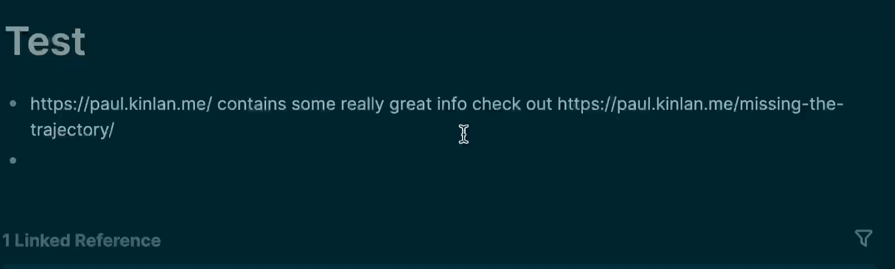

# Get Webpage title

This logseq plugin will extract the title of a web page and wrap the URL in markdown syntax to make it a little easier to read.

Simply type `/title` in the block and it will find the first link after the command and wrap it.

For example:

* `https://paul.kinlan.me/ contains some really great info /title check out https://paul.kinlan.me/missing-the-trajectory/` it will output `https://paul.kinlan.me/ contains some really great info check out [Missing the trajectory](https://paul.kinlan.me/missing-the-trajectory/)`. Note it only adds after `/title` and not for the link at the start.

## Limitations

* It operates cookieless so can't access any pages that would be behind a login or paywall.